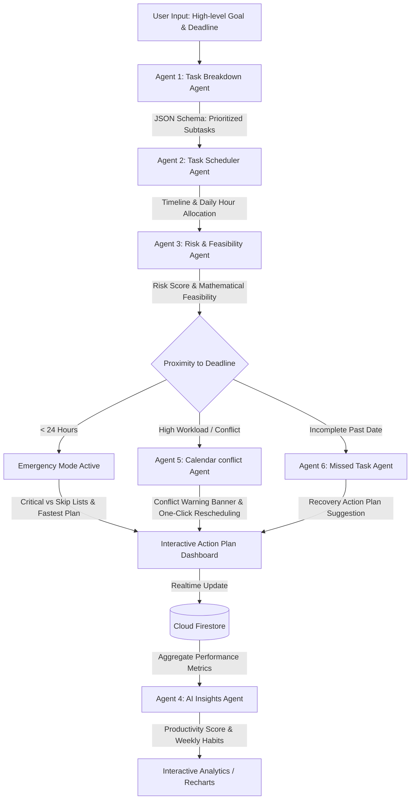

# ✈️ VibePilot AI
> **"Your AI Teammate for Beating Deadlines."**  
> *Active task planning, mathematical feasibility analysis, smart conflict resolution, and emergency panic-proofing.*

---

## 📌 Project Overview
**VibePilot AI** is a premium, next-generation AI productivity companion built for developers, students, and professionals who struggle with deadlines. 

Unlike traditional task managers that act as passive checklists, **VibePilot AI** is active. It leverages a structured **multi-agent pipeline powered by Google Gemini** to decompose high-level goals, construct day-by-day workload schedules, calculate mathematical deadline feasibility, and transition into a specialized **Emergency Mode** for tasks due in less than 24 hours.

Furthermore, VibePilot AI integrates an advanced, interactive **AI-powered Calendar View** that automatically visualizes workloads, detects schedule collisions, warns about overloaded days, suggests missed task recovery plans, and supports Google Calendar event exporting via standard iCalendar (.ics) files.

All of this is presented in a high-fidelity, glassmorphic dark-mode dashboard featuring real-time data synchronization with Firebase and interactive charts detailing user productivity habits.

---

## 🎯 Problem Statement & The Challenge
### The Background
Standard productivity tools rely on passive push reminders and static checklists. They do not prevent the **Planning Fallacy**—the human tendency to underestimate the time needed to complete a task. Users regularly add tasks, ignore basic notifications, and realize too late that completing the work is mathematically impossible, leading to missed commitments, academic failure, or professional burnout.

### The Challenge
To build a proactive productivity companion that:
1. Moves beyond traditional reminders to drive meaningful user action.
2. Assists users in planning, prioritizing, and executing goals before deadlines are missed.
3. Automatically calculates if a goal is physically achievable given remaining days and available hours.

---

## 💡 The VibePilot AI Solution
VibePilot AI introduces a proactive approach to time management:
* **Task Breakdown:** Large, intimidating goals (e.g., "Prepare for DSA Interview") are automatically broken down into digestible, prioritized micro-tasks.
* **Active Scheduling:** Distributes estimated hours day-by-day leading to the deadline.
* **Mathematical Feasibility Risk Index:** Computes if the remaining work hours exceed the user's available time. If yes, it sounds the alarm.
* **Impending Deadline Emergency Mode:** If a deadline is less than 24 hours away, VibePilot changes state, filtering critical tasks (must-do), mapping optional tasks (can skip), and offering a fastest-path execution plan.
* **Proactive Calendar Planner:** Instantly visualizes daily plans, highlighting deadlines, progress indices, and workload hours.

---

## 🛠️ Multi-Agent Workflow
VibePilot AI uses a sequential multi-agent chain to evaluate and plan tasks:



### 1. Task Breakdown Agent (`gemini-2.5-flash`)
* **Role:** Analyzes the goal title and description.
* **Output:** Decomposes it into micro-tasks with dedicated estimated times (hours) and priority levels (`Low`, `Medium`, `High`) mapped into a strict JSON schema.

### 2. Task Scheduler Agent (`gemini-2.5-flash`)
* **Role:** Distributes the estimated hours across the available days leading up to the deadline.
* **Output:** A structured, day-by-day chronological roadmap showing exactly what to focus on and for how long.

### 3. Risk & Feasibility Agent (`gemini-2.5-flash`)
* **Role:** Performs the math check. It multiplies remaining days by the user's available daily hours and compares it to the total estimated hours of work.
* **Output:** Outputs a risk score (`0-100`), a risk level (`Low`/`Medium`/`High`), detailed math-based reasons, and mitigation advice. If days remaining $\le 1$, it injects an **Emergency Plan**.

### 4. Calendar AI Planner Agent (`gemini-2.5-flash`)
* **Role:** Reviews tasks scheduled on a selected calendar day, checks available capacity, and scans for incomplete past schedules (missed tasks).
* **Output:** Generates a daily workload insight, actionable scheduling advice, warnings of overloaded days, recovery plans for missed sessions, and outputs structured action payloads (`taskId`, `suggestedDate`) enabling one-click task rescheduling.

### 5. AI Insights Agent (`gemini-2.5-flash`)
* **Role:** Aggregates user productivity data across all Firestore-stored tasks.
* **Output:** Computes a custom **Productivity Score (0-100)**, generates encouraging conversational summaries, and details multi-dimensional risk habit trends (e.g., Procrastination, Overbooking).

---

## ✨ Key Features
* 🔒 **Firebase Authentication (Google Sign-In):** Secure, isolated user profiles.
* ☁️ **Cloud Firestore Data Sync:** Real-time persistence for all task lists, subtask breakdowns, schedules, and AI insights.
* 📅 **AI Auto-Scheduling Calendar Grid:** 
  * Instantly plots task deadlines and scheduled blocks.
  * Dynamically maps subtask status checklists, duration, priority, and progress.
* 📊 **Calendar Analytics Dashboard:** Above-calendar KPI cards showing Total Tasks, Upcoming Deadlines, AI Scheduled Hours, Completed Tasks, Completion Rate, and Next Deadline Countdown.
* 🏷️ **Visual Indicator Legend:** Distinct tags mapping High/Medium/Low priority, AI Scheduled, Completed, and Missed tasks.
* 📈 **Progress Visualizations:** Dynamic horizontal progress bars showing goal progress percentages computed from subtask checklists (e.g. `[██████░░] 75%`).
* ⚡ **Conflict Detection & One-Click Rescheduling:** Warns if planned hours exceed daily limits or overlap. Offers one-click buttons to accept Gemini rescheduling suggestions.
* ⏰ **Missed Task Recovery:** Automatically flags past incomplete blocks with a `⚠️ Missed` indicator, offering Gemini-crafted recovery options.
* 🔋 **Daily Productivity Scoring:** Calculations showing Planned, Completed, and Pending hours, outputting a color-coded Score (Green/Yellow/Red).
* 📥 **Export to Google Calendar:** Generates standardized `.ics` iCalendar formats, enabling calendar importing.

---

## 🚀 Google Technologies Used
* **Gemini API (`@google/genai`):** Evaluates tasks using the high-performance `gemini-2.5-flash` model. We leverage Structured JSON Outputs (`responseMimeType: "application/json"` with schema declarations) to ensure absolute format consistency.
* **Firebase Authentication:** Handles seamless Google OAuth user log-ins.
* **Cloud Firestore:** A NoSQL real-time database that secures user data using server-side security rules, ensuring users can only read and write their own documents.

---

## 🏗️ System Architecture

```
                                  +---------------------------------+
                                  |         Next.js App             |
                                  |   (Framer Motion, Recharts)     |
                                  +---------------------------------+
                                       /                      \
                                      /                        \
                  +--------------------------+          +--------------------------+
                  |  Firebase Auth & SDK     |          |  App Router API Routes   |
                  |  (Google Sign-In)        |          |  (Next.js App Router)    |
                  +--------------------------+          +--------------------------+
                               |                                      |
                               | (Direct Sync)                        | (AI Requests)
                               v                                      v
                  +--------------------------+          +--------------------------+
                  |  Cloud Firestore         |          |  Google Gemini API       |
                  |  (User-scoped Tasks)     |          |  (gemini-2.5-flash)     |
                  +--------------------------+          +--------------------------+
```

---

## 💻 Installation & Setup

### Prerequisites
* [Node.js](https://nodejs.org/) (v18.x or later)
* A Google Gemini API Key (obtained from [Google AI Studio](https://aistudio.google.com/))
* A Firebase Project (setup via the [Firebase Console](https://console.firebase.google.com/))

### 1. Clone the Repository
```bash
git clone https://github.com/your-username/vibepilot-ai.git
cd vibepilot-ai
```

### 2. Configure Environment Variables
Create a `.env.local` file in the project root and add your keys:
```env
# Gemini API Configuration
GEMINI_API_KEY=your_gemini_api_key_here

# Firebase Web App Configuration
NEXT_PUBLIC_FIREBASE_API_KEY=your_firebase_api_key
NEXT_PUBLIC_FIREBASE_AUTH_DOMAIN=your_project.firebaseapp.com
NEXT_PUBLIC_FIREBASE_PROJECT_ID=your_project_id
NEXT_PUBLIC_FIREBASE_STORAGE_BUCKET=your_project.appspot.com
NEXT_PUBLIC_FIREBASE_MESSAGING_SENDER_ID=your_sender_id
NEXT_PUBLIC_FIREBASE_APP_ID=your_app_id
```

### 3. Install Dependencies
```bash
npm install
```

### 4. Run the Development Server
```bash
npm run dev
```
Open [http://localhost:3000](http://localhost:3000) to view the application running with Turbopack.

---

## 📸 Screenshots Placeholders

### 1. Landing & Google Authentication
> *A sleek dark-mode landing screen featuring glassmorphic cards and a single-click sign-in button using Google Authentication.*
```
+--------------------------------------------------------+
|  ✈️ VibePilot AI                                       |
|                                                        |
|     [ Beat Deadlines with Multi-Agent Planning ]       |
|                                                        |
|                 +--------------------+                 |
|                 | G Sign In with Google |                |
|                 +--------------------+                 |
+--------------------------------------------------------+
```

### 2. Interactive Task Dashboard
> *Your active cockpit. Lists tasks alongside their priorities, deadlines, and mathematical Risk score badges. Features quick toggles to start the AI breakdown workflow.*
```
+--------------------------------------------------------+
| ✈️ VibePilot   [Dashboard]  [Tasks]  [Calendar]  [Insights]  |
|--------------------------------------------------------|
| Active Tasks                                           |
|  - Finish UI Mockups    (Deadline: Jun 30) [Risk: High] |
|  - Write Pitch Deck     (Deadline: Jul 02) [Risk: Low]  |
|                                                        |
|  [ + Add New Task ]      [ ⚡ Run AI Multi-Agent Plan ] |
+--------------------------------------------------------+
```

### 3. Multi-Agent AI Action Plan Modal
> *Displays the detailed outputs of the agent chain: Subtasks (Breakdown), day-by-day workload charts (Schedule), and mathematical feasibility summaries (Risk Analysis).*
```
+--------------------------------------------------------+
|  AI ACTION PLAN: "Finish UI Mockups"                   |
|  [ Breakdown ]  [ Schedule ]  [ Risk Assessment ]      |
|--------------------------------------------------------|
|  * Day 1 (Jun 28): 2 hours - Outline page grids        |
|  * Day 2 (Jun 29): 2 hours - Create glassmorphic cards |
|  * Day 3 (Jun 30): 1 hour  - Connect lucide icons      |
|                                                        |
|  [ Save Action Plan ]                    [ Close ]     |
+--------------------------------------------------------+
```

### 4. Interactive Workload Calendar
> *Displays your deadlines as priority-colored badges, overlaid with AI scheduled hours. Highlights heavy workload days in yellow/red warning alerts.*
```
+--------------------------------------------------------+
| ✈️ VibePilot   [Dashboard]  [Tasks]  [Calendar]  [Insights]  |
|--------------------------------------------------------|
|  < June 2026 >                                         |
|  +-----+-----+-----+-----+-----+-----+-----+           |
|  | Sun | Mon | Tue | Wed | Thu | Fri | Sat |           |
|  |     |     |     |  28 |  29 |  30 |     |           |
|  |     |     |     | [2h]| [2h]|🎯UI |     |           |
|  +-----+-----+-----+-----+-----+-----+-----+           |
+--------------------------------------------------------+
```

### 5. AI Insights & Habits Analytics
> *Features a Recharts Line Chart for task completion history, a Bar Chart for risk-habit diagnostics, and custom productivity advice written by Gemini.*
```
+--------------------------------------------------------+
| ✈️ VibePilot   [Dashboard]  [Tasks]  [Calendar]  [Insights]  |
|--------------------------------------------------------|
|  Productivity Score: 85/100   (Weekly Trend: Up 📈)     |
|                                                        |
|  Completion Trends:       Risk Trends:                 |
|    |                      Procrastination: [==    ] 30 |
|    |__/\_                 Overbooking:     [===== ] 80 |
|                                                        |
|  Recommendations:                                      |
|   1. Reduce daily task load; you are overbooking.       |
|   2. Break down large milestones into smaller chunks.  |
+--------------------------------------------------------+
```

---

## 🔮 Future Scope
* 📅 **Native Calendar Two-Way Sync:** Automatically syncing external Google Calendar events into VibePilot dashboard views.
* 💬 **Automated Chatbot Notifications:** Push risk updates and deadline notifications directly via Discord and Slack webhooks.
* 👥 **Team Collaborative Planning:** Allow group members to assign subtasks, sync schedules, and calculate combined team deadline feasibility.
* 🎙️ **Voice Task Input:** Integration of Gemini's Multimodal Web API to accept audio-based task descriptions and convert them to plans.
